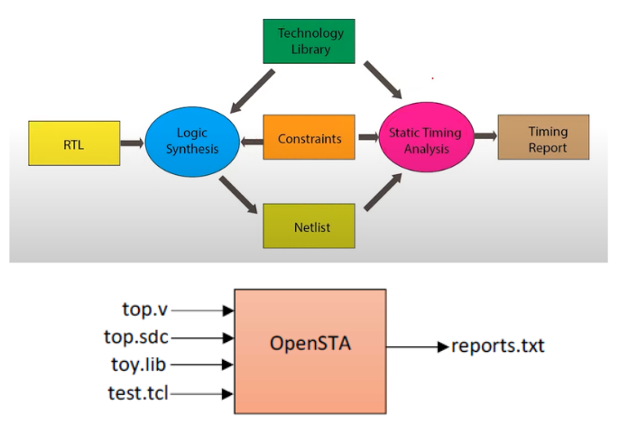
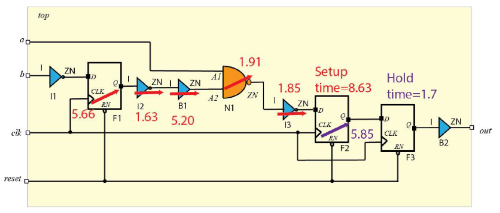
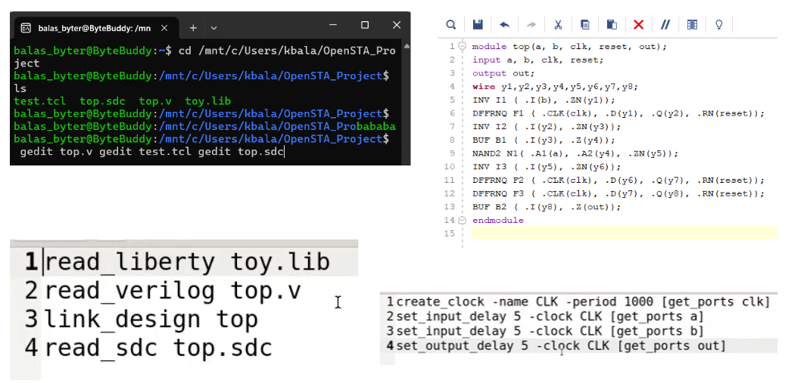
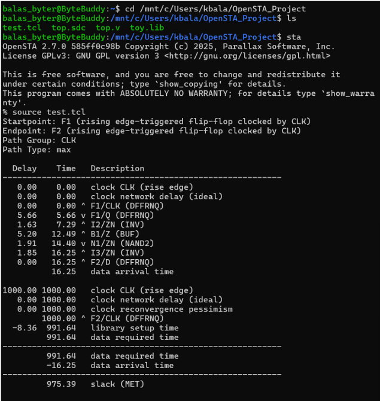
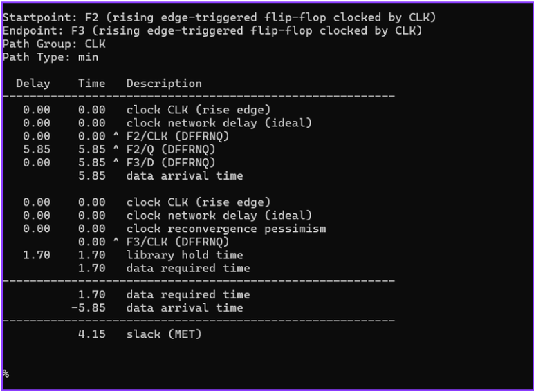
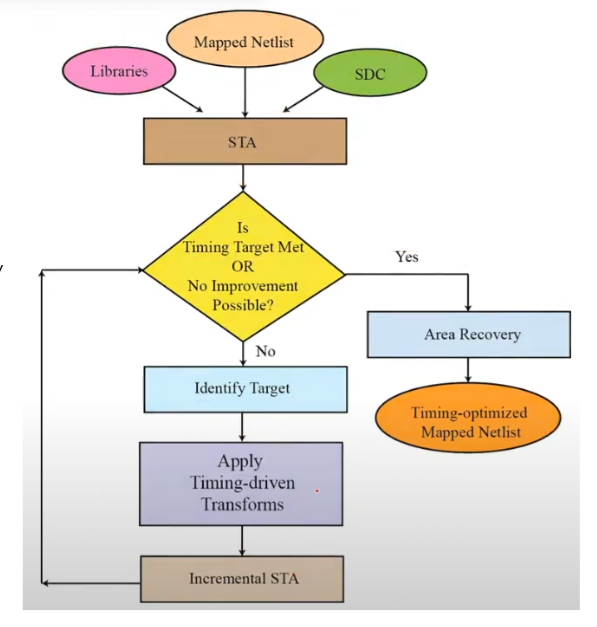

# Static Timing Analysis — OpenSTA
### Setup/Hold Slack Analysis on RTL to Gate-Level Netlist Flow
> Tool: OpenSTA 2.7.0 | Completed at Fermi IC Design, Bangalore

---

## 🔍 Overview
Static Timing Analysis (STA) performed using OpenSTA on a sequential
digital circuit. The design includes flip-flops, inverters, buffers,
and NAND gates. Setup and hold slacks are verified using a custom
liberty library, SDC constraints, and TCL script.

**Key Results:**
- ✅ Setup Slack: **975.39 ps (MET)**
- ✅ Hold Slack: **4.15 ps (MET)**

---

## ⚙️ STA Flow


The complete flow from RTL to timing report:
RTL (top.v) feeds into Logic Synthesis, combined with
Constraints (top.sdc) and Technology Library (toy.lib),
all processed by OpenSTA using test.tcl to generate
the final Timing Report.

---

## 🛠️ Tools & Files

| File | Description |
|------|-------------|
| `top.v` | Verilog gate-level netlist (INV, BUF, NAND2, DFFRNQ) |
| `top.sdc` | SDC constraints — clock period 1000ps, IO delays |
| `toy.lib` | Liberty timing library with cell delay values |
| `test.tcl` | OpenSTA TCL script — reads liberty, verilog, links design, reads SDC |

---

## 📋 SDC Constraints Used

```tcl
create_clock -name CLK -period 1000 [get_ports clk]
set_input_delay 5 -clock CLK [get_ports a]
set_input_delay 5 -clock CLK [get_ports b]
set_output_delay 5 -clock CLK [get_ports out]
```

---

## 📋 OpenSTA TCL Script

```tcl
read_liberty toy.lib
read_verilog top.v
link_design top
read_sdc top.sdc
```

---

## 📐 Circuit Under Analysis
Sequential circuit with 3 flip-flops (F1, F2, F3),
inverters (I1–I3), buffer (B1, B2), and NAND gate (N1).



---

## 📊 OpenSTA Demo
Terminal showing OpenSTA 2.7.0 execution with all
source files loaded and timing analysis run:



---

## ✅ Timing Results

### Setup Slack — 975.39 ps (MET ✅)
Critical path: F1 → I2 → B1 → N1 → I3 → F2
Data arrival time: 16.25 ps
Data required time: 991.64 ps
Setup Slack: 975.39 ps



### Hold Slack — 4.15 ps (MET ✅)
Path: F2 → F3
Data arrival time: 5.85 ps
Data required time: 1.70 ps
Hold Slack: 4.15 ps



---

## 🔄 Timing Optimization Loop



After performing STA using mapped netlist, standard cell
libraries and SDC constraints, two outcomes are possible.
If timing target is met, the design proceeds to area
recovery to reduce chip area and power. If timing
violations exist, STA identifies the critical path and
applies timing-driven transformations such as gate sizing,
buffering, or restructuring. Incremental STA is then run
again to validate improvements, forming a continuous loop
until timing closure is achieved.

---

## 📌 Key Concepts Covered
- Arrival Time vs Required Time calculation
- Setup Slack = Required Time minus Arrival Time
- Hold Slack = Arrival Time minus Hold Required Time
- Clock-to-Q delay analysis
- Liberty library cell characterization
- SDC constraint definition and clock period setting
- OpenSTA 2.7.0 full command flow on Linux/WSL
- Critical path identification and timing closure

---

## 📁 How to Run

Install OpenSTA on Linux or WSL, then run:

```bash
cd OpenSTA_Project
sta
% source test.tcl
```

This will read all files and generate setup and hold
timing reports automatically.

---

## 👤 Author
**Balajothi K**
ECE Pre-Final Year — Lovely Professional University
📧 kbalajothikathirvel@gmail.com
🔗 [LinkedIn](https://www.linkedin.com/in/balajothi-kathirvel/)
🐙 [GitHub](https://github.com/bala7415)
